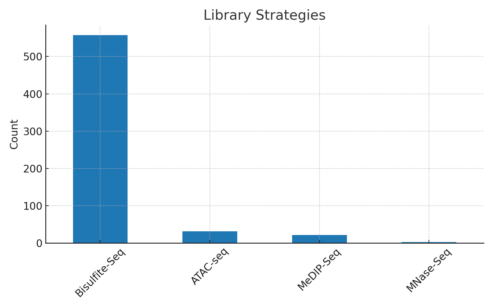
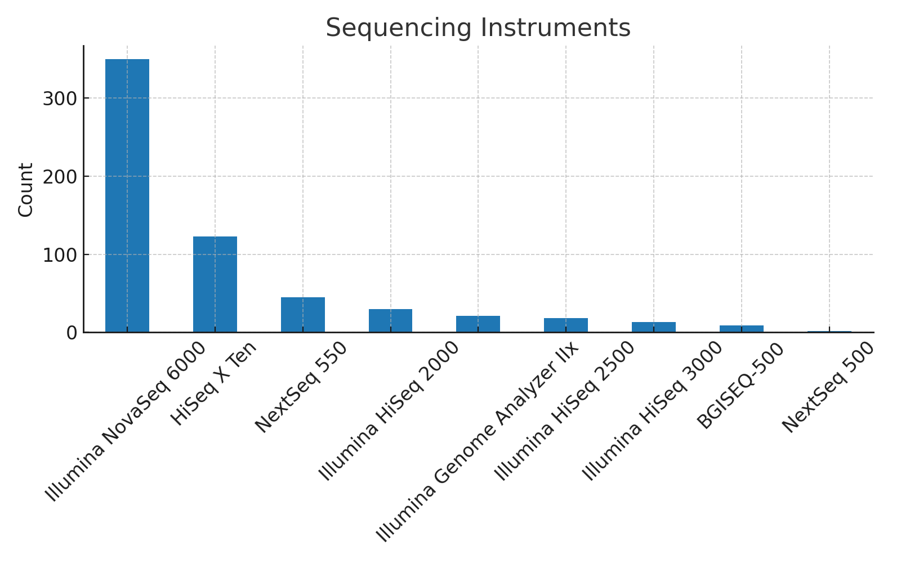
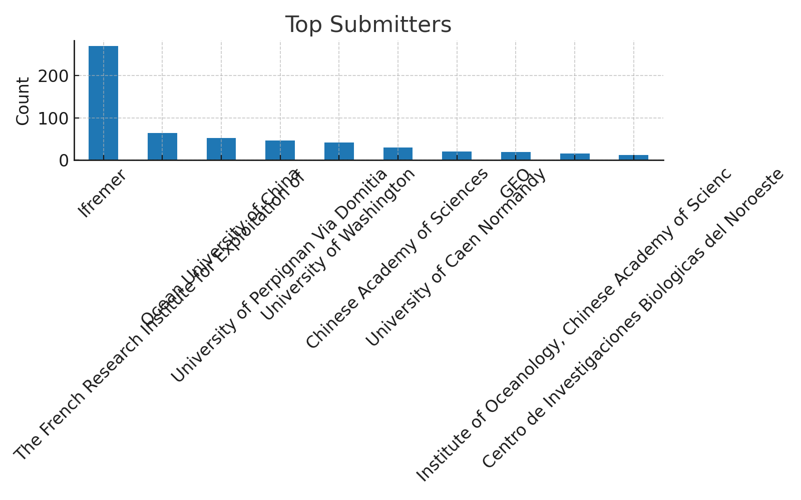
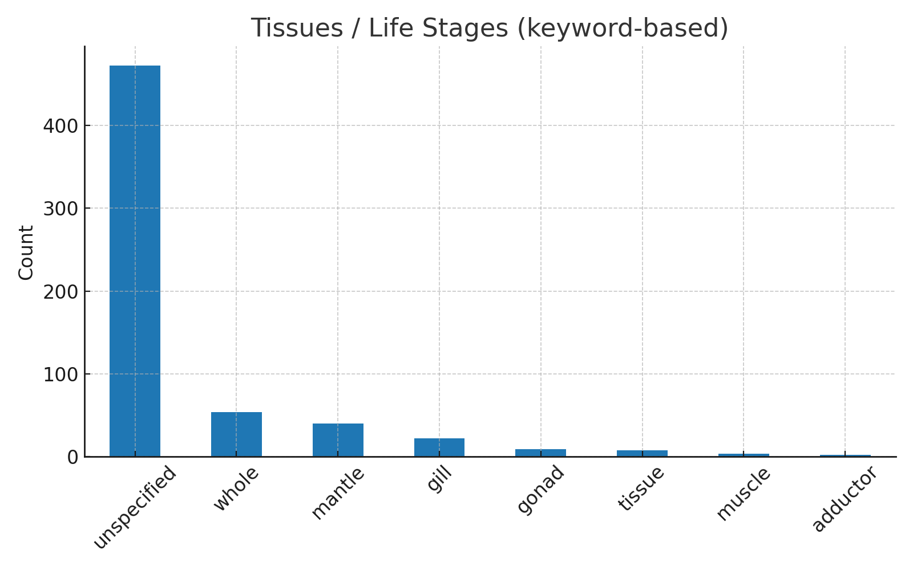
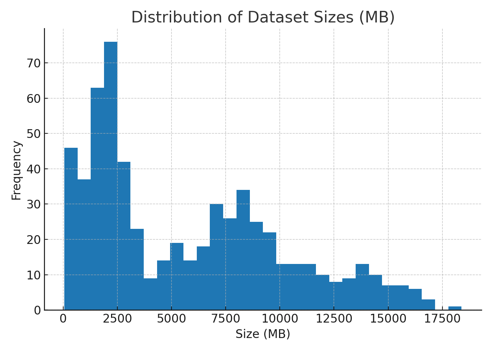

# 📊 Summary Report of SRA Results Table

## Dataset Overview
- **Total entries:** 611 experiments  
- **Columns:** 17 (metadata on experiments, samples, sequencing, and libraries)  
- **Organisms represented:**  
  - *Magallana gigas* (Pacific oyster) — dominant (576/611 entries)  
  - 2 other species appear but rarely  

---

## Experiment & Study Details
- **Unique experiments:** 611  
- **Experiment titles:** 482 unique (some repeated across multiple runs)  
- **Studies:** 26 unique *Study Accession* numbers  
- **Most common study:** *ERP145459* (“Genetic and epigenetic variations underpin rapid adaptation...”) with 246 entries  

---

## Sample Information
- **Samples:** 559 unique *Sample Accessions*  
- **Sample titles:** 517 provided (most labeled “Pacific oyster”)  
- **Runs per experiment:** Typically 1 (average 1.02, max 4)  

---

## Sequencing Information
- **Instruments used:** 9 total, dominated by **Illumina NovaSeq 6000** (350 entries)  
- **Submitters:** 15 institutions, top contributors include **Ifremer** (270 entries) and **Ocean University of China**  

---

## Data Volume
- **Total size per experiment:**  
  - Mean: ~5.7 GB  
  - Range: 52 MB → 18.4 GB  
- **Total spots (reads):**  
  - Mean: ~60.6 million  
  - Range: ~0.6M → 212M  
- **Total bases:**  
  - Mean: 1.62 × 10¹⁰  
  - Max: 5.05 × 10¹⁰  

---

## Library Information
- **Library strategies:**  
  - Bisulfite-Seq (most common, 557 entries)  
  - ATAC-seq and a few others  
- **Library sources:** Almost all **GENOMIC**  
- **Library selections:** 11 types; most common = **other** (294 entries) and **RANDOM PCR**  

---

## Tissue / Life Stage Information
Keyword-based extraction from experiment/sample/study titles identified:  
- **Gill, mantle, gonad, muscle, larvae, sperm, embryo, whole tissue**  
- Many entries remain **unspecified** due to limited metadata  

---

## Visual Summaries

### Library Strategies

### Sequencing Instruments

### Top Submitters

### Tissues / Life Stages

### Data Size Distribution

---

✅ **In short:** This dataset is heavily focused on **Pacific oyster (Magallana gigas)** genomic methylation/epigenetic studies, primarily generated on **Illumina NovaSeq 6000** by a handful of groups (notably Ifremer and Ocean University of China). Data volumes per experiment are large (5–18 GB), with most libraries sequenced via **Bisulfite-Seq** for DNA methylation and some **ATAC-seq** for chromatin accessibility.
